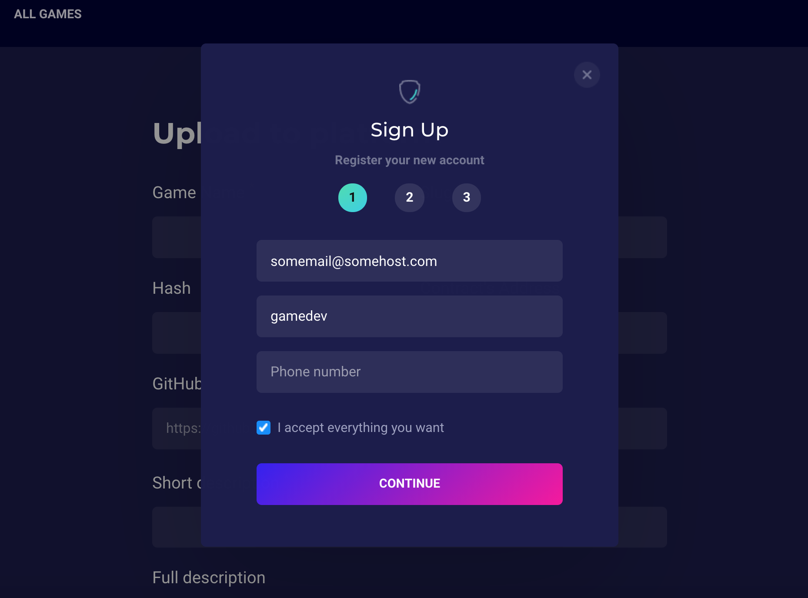
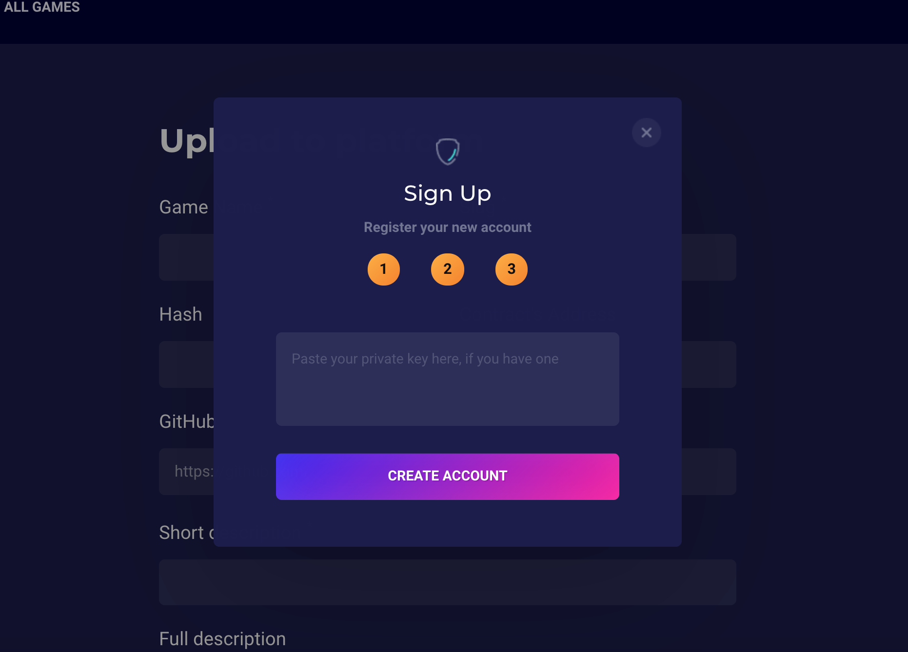
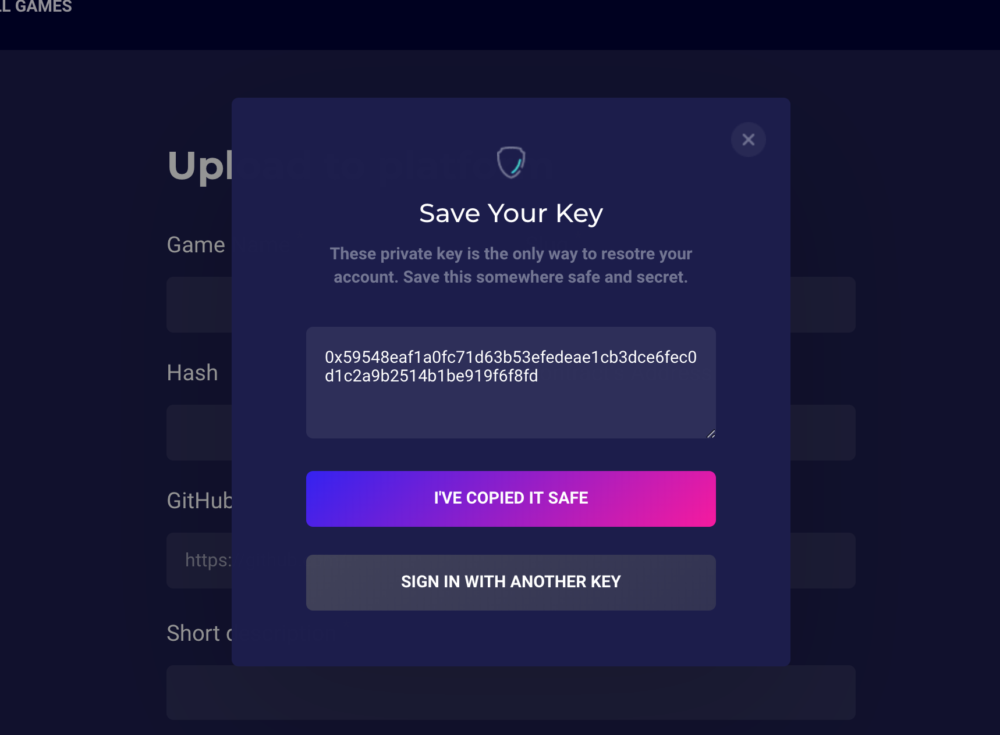
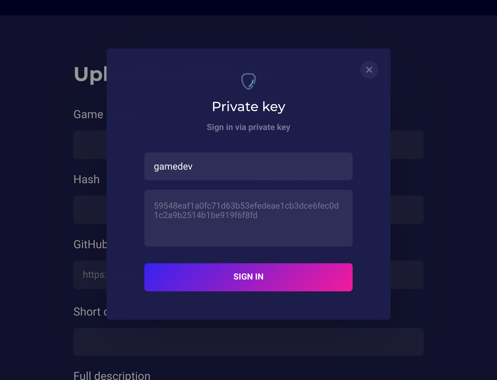
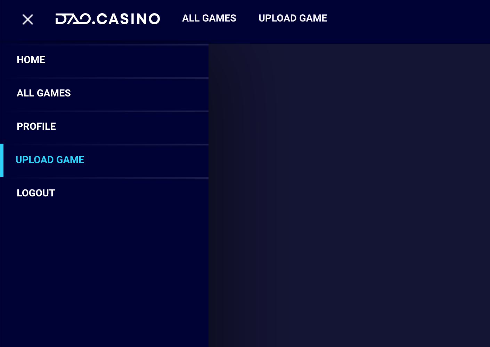
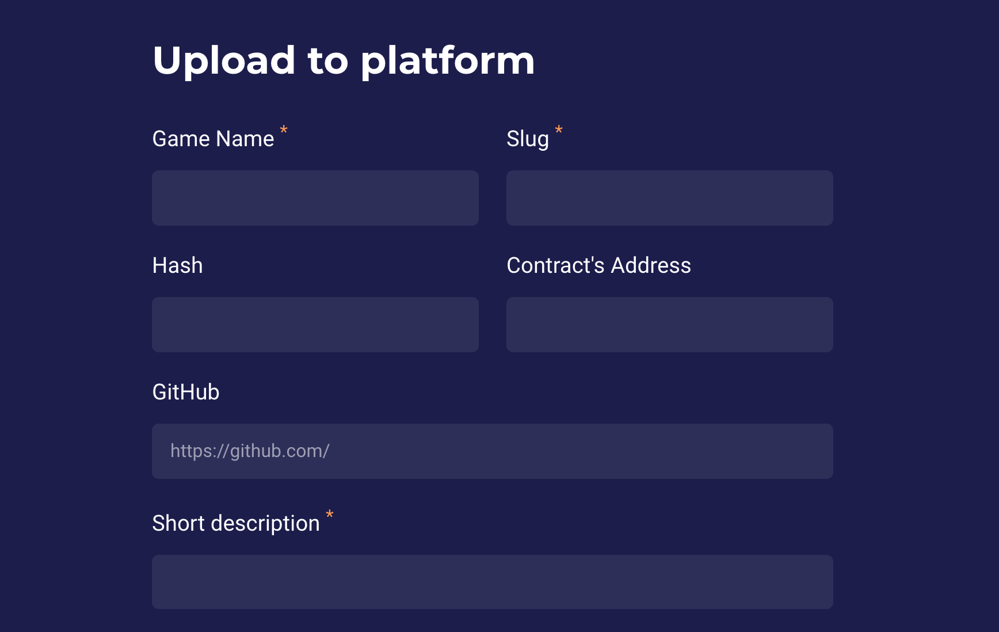
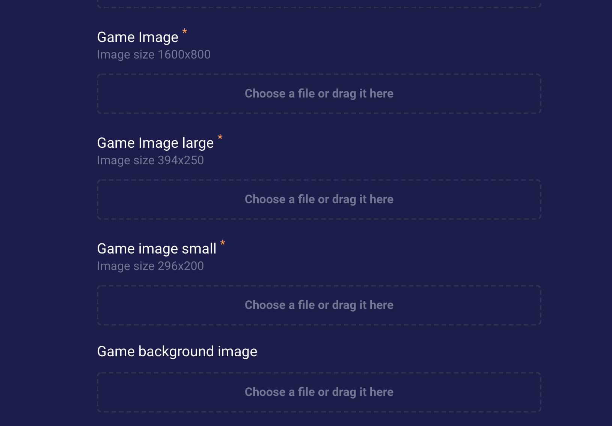
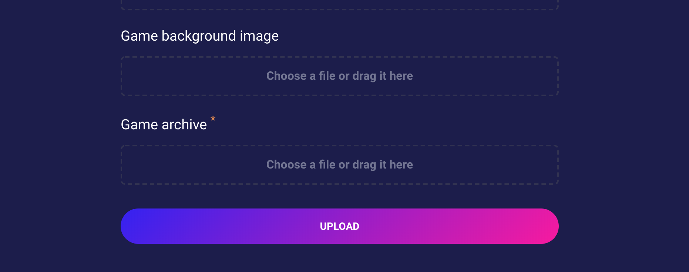

# Загрузка игр на платформу

## 1. Зарегистрируйтесь на платформе

Нажмите на кнопку Sign Up в правом верхнем углу

Вверите ваш E-Mail и имя пользователя. Эти поля обязательны.



Если у вас уже есть Private Key - введите его здесь



Если у вас нет Private Key, или вы хотите получить новый - нажмите кнопку Create Account с пустым полем. Будет сгенерирован новый Private Key, скопируйте его:



Авторизуйтесь:



# Сборка и загрузка

## Загрузка

После авторизации, в меню и шапке появиться пункт Upload Game:



- Введите название игры и Slug (Уникальный идентификатор игры). Игра будет доступна по адресу http://dapps.dao.casino/[slug]
- Введите short description (краткое описание игры). Оно будет отображаться в слайдере на главной и на странице игры.



Подготовьте изображения игры (обрежте предварительно все картинки в графическом редакторе в соответствии с требуемыми разрешениеями):

- Game image - основное изобажение игры. Будет отображаться в слайдере на главной странице платформы.
- Game image large - крупная иконка игры. Будет отображаться на главной странице портала в списке Latest Releases
- Game image small - маленькая иконка игры. Будет отображаться в разделе All Games.
- Game background image - бэкграунд игры. Будет отображаться на странице игры фоном.



## Сборка:

```bash
  # в директории с игрой:
  dc-cli build
  cd ./build
  zip -r game.zip ./ # архив для загрузки на платформу
```

Game archive: прикрепите здесь фаил game.zip



Нажмите кнопку Upload.

Готово! Ждите апрува на платформе.


